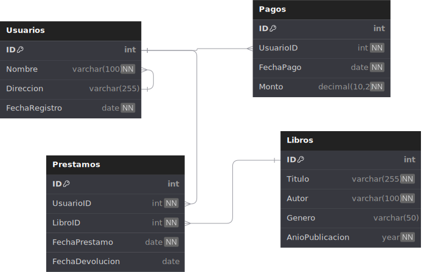

# Justificación del Diseño de la Base de Datos

## Introducción

Este documento describe el diseño de la base de datos para el Sistema de Gestión de Biblioteca. Se incluyen las decisiones de diseño basadas en el cumplimiento de las normas de normalización (hasta 3NF) y la eliminación de redundancias, asegurando integridad y optimización.

## Modelo de Entidades y Relaciones

El diseño inicial identifica las siguientes entidades:

1. **Usuarios**:
   - Representa a los socios de la biblioteca.
   - Atributos principales: `ID`, `Nombre`, `Dirección`, `Fecha de Registro`.
2. **Libros**:
   - Contiene información sobre los libros disponibles en la biblioteca.
   - Atributos principales: `ID`, `Título`, `Autor`, `Género`, `Año de Publicación`.
3. **Préstamos**:
   - Registra las transacciones de préstamo de libros.
   - Atributos principales: `ID`, `UsuarioID (FK)`, `LibroID (FK)`, `Fecha Préstamo`, `Fecha Devolución`.
4. **Pagos**:
   - Detalla el historial de pagos mensuales de los usuarios.
   - Atributos principales: `ID`, `UsuarioID (FK)`, `Fecha de Pago`, `Monto`.

## Justificación de la Normalización

### Primera Forma Normal (1NF)

Cada tabla contiene datos atómicos y no repetitivos:

- Los atributos son indivisibles (e.g., `Nombre` no está dividido en partes como Nombre y Apellido).
- Se eliminan grupos repetitivos en los registros.

### Segunda Forma Normal (2NF)

Las tablas cumplen con 1NF y todos los atributos no clave son funcionalmente dependientes de la clave primaria:

- Ejemplo: En la tabla Préstamos, los atributos `Fecha Préstamo` y `Fecha Devolución` dependen completamente de la combinación de `UsuarioID` y `LibroID`.

### Tercera Forma Normal (3NF)

Se eliminan dependencias transitivas:

- Atributos como `Autor` y `Género` pertenecen exclusivamente a la tabla Libros, asegurando que no dependan de entidades externas como *Usuarios*.

## Restricciones de Integridad

- **Claves primarias**: Garantizan la unicidad de cada registro.
- **Claves foráneas**: Aseguran la relación entre tablas:
  - `UsuarioID` en Préstamos referencia a Usuarios.
  - `LibroID` en Préstamos referencia a Libros.
- **Restricciones adicionales**:
  - **`NOT NULL`** en campos obligatorios como Nombre en `Usuarios` y `Título` en Libros.
  - **`UNIQUE`** para evitar duplicados en campos como el nombre de libros.

## Operaciones en Cascada

Para mantener la consistencia de los datos, se aplican las siguientes operaciones:

- **ON DELETE CASCADE**: Si se elimina un usuario o libro, también se eliminan los préstamos relacionados.
- **ON UPDATE CASCADE**: Si se actualiza un ID relacionado, los cambios se reflejan en las tablas dependientes.

## Consultas Avanzadas

- **INNER JOIN**: Obtener préstamos junto con detalles de usuarios y libros.
- **LEFT JOIN**: Listar todos los usuarios, incluso si no tienen préstamos.
- **RIGHT JOIN**: Mostrar todos los libros, incluso si no han sido prestados.
- **Funciones agregadas**: Calcular el total de multas acumuladas por un usuario.

## Índices

Se crean índices para mejorar el rendimiento de las consultas más frecuentes:

- Índice en el campo `Nombre` de la tabla Usuarios para búsquedas rápidas.
- Índice compuesto en `UsuarioID` y `Fecha Préstamo` de la tabla Préstamos para optimizar reportes de historial.

## Diagramas

### DBML

```DBML
Table Usuarios {
  ID int [pk, increment]
  Nombre varchar(100) [unique, not null]
  Direccion varchar(255)
  FechaRegistro date [not null]
}

Table Libros {
  ID int [pk, increment]
  Titulo varchar(255) [not null, unique]
  Autor varchar(100) [not null]
  Genero varchar(50)
  AnioPublicacion year [not null]
}

Table Prestamos {
  ID int [pk, increment]
  UsuarioID int [not null, ref: > Usuarios.ID]
  LibroID int [not null, ref: > Libros.ID]
  FechaPrestamo date [not null]
  FechaDevolucion date
}

Table Pagos {
  ID int [pk, increment]
  UsuarioID int [not null, ref: > Usuarios.ID]
  FechaPago date [not null]
  Monto decimal(10, 2) [not null]
}
```

### Captura


